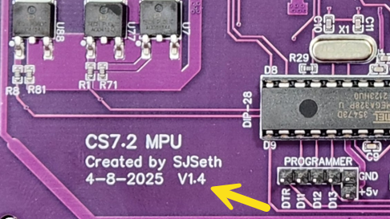
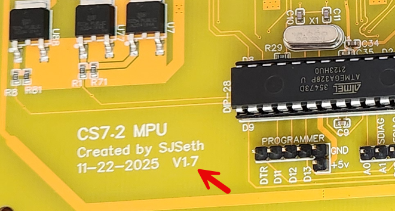

# V1.7 Firmware

## Important! This firmware is for v1.7 boards and newer. Right now, all the v1.7 boards are yellow... If your board isn't yellow, this won't work for you!

The board versions can be found in the lower left corner of the PCB. 

# FAQ

Q: What does this firmware do that the previous version don't?

A: The v1.7+ boards have the TMC2209 diag pins wired up so that we can use the stallguard feature which allows us to monitor the current/resistance on the motor to detect a stall/jam. 